## **1. _SmashBruh_ Movie Renting Website - Documentation**

### **1.1. Team member**

| Full Name            | Student Id |                                                                                                 Tasks                                                                                                  |
| -------------------- | :--------: | :----------------------------------------------------------------------------------------------------------------------------------------------------------------------------------------------------: |
| Nguyễn Ngọc Vĩnh     |   18691    | _Movie and TV Shows details, trailers, and recommendations backend API; Movie Search and Filtering API; UI/UX of Homepage and MoviePage; Markdown and Swagger Documentation, Analytics and Reporting._ |
| Hà Quách Phú Thành   |   18840    |                                                                                                Backend                                                                                                 |
| Thái Quang Nam       |   18770    |                                          _Design Navbar, HomePage, FeatureMoviePage, TVShowsPage, MyListPage, SearchPage; Markdown Documentation, Reporting_                                           |
| Phạm Hoàng Việt      |   18334    |                                                                                             User Interface                                                                                             |
| Nguyễn Xuân Khang    |   18973    |                                                                                           Profile Interface                                                                                            |
| Nguyễn Khắc Hoàng    |   18230    |                                                                                             User Interface                                                                                             |
| Lê Duy               |   17434    |                                                                                                Security                                                                                                |
| Trần Ngọc Duy Chương |   17197    |                                                                                                Backend                                                                                                 |

### **1.2. About our project**

Welcome to _SmashBruh_, the ultimate movie rental destination that redefines the way you experience films. Our project aims to provide a seamless and captivating movie-watching journey for cine-philes and casual viewers alike. At _SmashBruh_, we understand the frustration that often accompanies the search for the perfect movie. Endless scrolling, limited availability, and the absence of detailed information can dampen the excitement of discovering new films. That's why we've created a platform that addresses these challenges and puts the power of choice in your hands. _SmashBruh_ goes beyond traditional movie rentals by offering convenience and flexibility. Our platform allows you to enjoy your favorite films anytime, anywhere, and on any device. Say goodbye to the limitations of physical media or the frustration of waiting for a DVD to arrive. With our seamless streaming technology, you can instantly access the movies you love, whether you're at home, on the go, or traveling abroad.

In summary, _SmashBruh_ is not just a movie rental website; it's a gateway to a world of cinematic wonders.

## **2. Table of content**

- [**1. _SmashBruh_ Movie Renting Website - Documentation**](#1-smashbruh-movie-renting-website---documentation)
  - [**1.1. Team member**](#11-team-member)
  - [**1.2. About our project**](#12-about-our-project)
- [**2. Table of content**](#2-table-of-content)
- [**3. Introduction**](#3-introduction)
  - [**3.1. Project Overview**](#31-project-overview)
  - [**3.2. Objective**](#32-objective)
  - [**3.3. Goals**](#33-goals)
- [**4. System Analysis**](#4-system-analysis)
  - [**4.1. Business Requirements**](#41-business-requirements)
  - [**4.2. User Requirements**](#42-user-requirements)
  - [**4.3. Functional Requirements**](#43-functional-requirements)
  - [**4.4. Non-Functional Requirements**](#44-non-functional-requirements)
  - [**4.5. Deployment Plan**](#45-deployment-plan)
- [**5. System Design**](#5-system-design)
  - [**5.1. System Architecture**](#51-system-architecture)
    - [**5.1.1. MVC Models for Web Development**](#511-mvc-models-for-web-development)
  - [**5.2. Components Design**](#52-components-design)
    - [**5.2.1. Users Interface:**](#521-users-interface)
    - [**5.2.2. Admin Interface:**](#522-admin-interface)
    - [**5.2.3. Authentication Interface:**](#523-authentication-interface)
  - [**5.3. Structure and Relationships**](#53-structure-and-relationships)
  - [**5.4. Data Model**](#54-data-model)
  - [**5.5. GUI**](#55-gui)
  - [**5.6. Functionality Design**](#56-functionality-design)
- [**6. Implementation**](#6-implementation)
  - [**6.1. Development Environment and Technology Stack**](#61-development-environment-and-technology-stack)
- [**7. User Guide**](#7-user-guide)
  - [**7.1. Getting Started**](#71-getting-started)
- [**8. Conclusion**](#8-conclusion)
  - [**8.1. Summary of Project**](#81-summary-of-project)
  - [**8.2. Future Work**](#82-future-work)
  - [**8.3. References**](#83-references)

## **3. Introduction**

### **3.1. Project Overview**

_SmashBruh_ is an movie rental website that aims to transform the way people discover and rent movies. Our project aims to provide options for users to view the information related to movies and shows. They also have the choice to choose which movie or show to rent and have their rented information saved for later use.

### **3.2. Objective**

- **_Extensive Movie Library:_** Curate a diverse collection of films across genres, eras, and cultures to cater to the varied preferences of our users. From classic masterpieces to the latest releases, ensure a wide range of options that cover different cinematic experiences.

- **_User-Friendly Interface:_** Develop an intuitive and easy-to-navigate website interface that allows users to seamlessly explore and discover movies. Implement robust search functionality, filters, and sorting options to facilitate effortless movie browsing.

- **_Detailed Movie Information:_** Provide comprehensive and accurate movie information to assist users in making informed decisions. Include detailed descriptions, plot summaries, cast and crew details, user ratings, and reviews to give users valuable insights into each film.

- **_Personalized Recommendations:_** Implement a sophisticated recommendation system that analyzes user preferences on the movies and shows currently accessed. Generate personalized movie suggestions that align with users' tastes, helping them discover new films and broaden their cinematic horizons.

- **_Easy Rental Process:_** Streamline the movie rental process to make it convenient and hassle-free for users. Implement a straightforward rental system where users can choose their desired movies, rental duration, and complete secure online payments.

## **4. System Analysis**

### **4.1. Business Requirements**

The business requirements of _SmashBruh_ are as follows:

- **_Broad Selection of Content:_** Users expect a wide variety of movies and TV shows across different genres, including popular releases, classics, and niche titles. They want access to a diverse library that caters to their individual preferences and interests.
- **_User Account Management:_** _SmashBruh_ requires a user account management system to allow users to create profiles, save preferences, manage their watch lists, and track their searching history. This feature provides a personalized experience and enables users to easily access and organize their preferred content.
- **_Cross-Platform Accessibility:_** _SmashBruh_ should be accessible across different devices and platforms, including web browsers, mobile devices, and smart TVs. This ensures that users can enjoy their favorite content conveniently, regardless of the device they are using.
- **_Analytics and Reporting:_** The platform requires robust analytics and reporting capabilities to track user behavior, content popularity, and performance metrics. These insights help in making data-driven decisions, improving the user experience, and optimizing the content library.

By fulfilling these business requirements, _SmashBruh_ can create a user-friendly interface, up-to-date information and a stable searching and recommendation system inside the rental movie system to maintain the flow of the website.

### **4.2. User Requirements**

The user requirements of _SmashBruh_ are as follows:

- **_Firt Time User Experience:_** _SmashBruh_ provides visitors latest movie that the system have to offer and other information of available movies and shows ath the moment so that the system keeps up with user's interest.
- **_Efficient Search and Filtering:_** Users require an efficient search functionality that allows them to search for specific titles, genres, actors, directors, or keywords. They also expect advanced filtering options to refine their search results based on criteria such as release year, ratings, and language.
- **_Movie Information Based Recommendations:_** Users appreciate personalized recommendations based on their current accessed movies and shows. It could be based on names, genres, cast.
- **_Ratings:_** Users value the ability to read and contribute to ratings. They want a platform that encourages user feedback, enabling them to make informed decisions and engage in discussions with other movie enthusiasts.
- **_Flexible Rental Options:_** Users prefer flexible rental options, including various pricing plans with understandable cost to spend. They want the freedom to choose the rental plan that suits their preferences and viewing habits.
- **_Cross-Platform Compatibility:_** Users want the flexibility to access _SmashBruh_ on multiple devices, including web browsers, smartphones, tablets, and smart TVs. They expect a seamless experience that allows them to pick up where they left off across different devices.
- **Simple Payment Processing:\_** Users don't have to worry about payment system because we uses simple calculation (addtion, subtraction, multiplication and division) based on what users have chosen to be their pricing plan mentioned in the previous part.

By addressing these user requirements, _SmashBruh_ can provide a user-centric experience that meets the expectations of movie enthusiasts, offering them a vast selection of content, seamless navigation and personalized recommendations.

### **4.3. Functional Requirements**

The functional requirements of _SmashBruh_ are as follows:

- **_User Registration and Account Management:_**
  - Users should be able to create an account and provide necessary information.
  - Users should be able to log in securely and manage their account settings.
- **_Content Catalog and Search:_**
  - The platform should maintain a comprehensive catalog of movies and TV shows.
  - Users should be able to search for content by title.
  - Advanced filtering options should be available to refine search results.
- **_Movie and TV Show Details:_**
  - Users should be able to view detailed information about each movie or TV show, including synopsis, cast, director, ratings, and reviews.
  - The platform should display relevant recommendations and similar content.
- **_Rental Options:_**
  - Users should be able to select rental pricing plans.
  - The platform should provide pricing details, rental durations, and availability information.
- **_Payment Processing:_**
  - The platform should securely process payments using simple calculations.
  - Users should receive a decreasing amount of money in their net balance
- **My list and Favourites:\_**
  - Users should be able to create and manage a watch list of movies and TV shows.
  - The platform should provide personalized recommendations based on user preferences and ratings.
- **_Ratings:_**
  - Users should be able to rate stars score for movies and TV shows.
  - The platform should display average ratings and aggregate reviews for each title.
- **_Analytics and Reporting:_**
  - The platform should collect and analyze data to generate insights on user behavior, content popularity, and platform performance.

### **4.4. Non-Functional Requirements**

The non-functional requirements of _SmashBruh_ are as follows:

- **_Performance:_**
  - The platform should have fast loading times and responsive navigation to provide a seamless user experience.
  - Streaming of movies and TV shows should be smooth and uninterrupted, with minimal buffering.
- **_Scalability and Availability:_**
  - The platform should be designed to handle a growing user base and increasing traffic without compromising performance.
  - It should be scalable to accommodate a large number of concurrent users and a growing content library.
  - The platform should have a high level of availability, minimizing downtime and ensuring users can access the service whenever they need it.
  - Measures such as redundancy, load balancing, and backup systems should be in place to maintain availability.
- **_Security:_**
  - The platform should implement robust security measures to protect users' personal information, payment details, and viewing history.
  - Secure encryption protocols should be used to ensure the confidentiality and integrity of data.
- **_Compatibility:_**
  - The platform should be compatible with various operating systems, web browsers, and devices to accommodate a wide range of user preferences.
  - It should adapt to different screen sizes and resolutions, providing a consistent and optimized experience across devices.
- **_Usability:_**
  - The platform should have a user-friendly and intuitive interface, making it easy for users to navigate, search for content, and manage their account.
  - Clear and concise instructions and tooltips should be provided to guide users through different features and functionalities.
- **_Data Privacy:_**
  - The platform should comply with data protection regulations and ensure the privacy of user data.
  - Clear privacy policies and consent mechanisms should be in place, informing users about data collection, storage, and usage practices.
- **_Performance Monitoring and Optimization:_**
  - The platform should have monitoring mechanisms in place to track performance metrics, identify bottlenecks, and optimize system performance.
  - Regular performance testing and optimization should be conducted to ensure optimal user experience.
- **_Cross-Platform Accessibility:_**
  - The platform should be accessible across devices and platforms, including web browsers, mobile devices, and smart TVs.

### **4.5. Deployment Plan**

- **_Infrastructure Setup:_** Determine the hosting environment for your application, whether it's a cloud-based solution like on-premises server. Set up the necessary infrastructure, including MongoDB servers, databases, and networking components, ensuring scalability, reliability, and security.

- **_Code Packaging:_** Prepare your application for deployment by packaging the code, including all dependencies, libraries, and configurations, into a deployable package. This may involve bundling the frontend code (HTML, CSS, JavaScript, MUI Library for CSS) and containerizing the backend code using technologies like Docker.

- **_Configuration Management:_** Define and manage the application's configuration settings, such as database credentials, API keys, and other environment-specific variables. Ensure that these settings are securely stored and easily configurable for different deployment environments (e.g., development, staging, production).

- **_Testing and Quality Assurance:_** Conduct thorough testing of the application to identify and fix any issues or bugs. Perform functional testing, integration testing, and load testing to ensure the application performs well under expected loads and behaves as intended.

- **_Data Migration:_** If you are migrating from a previous version of the application or integrating with existing data sources, plan and execute a data migration strategy to ensure a smooth transition of data to the new deployment environment. This may involve transforming and importing data from legacy systems or integrating with external APIs.

- **_Deployment Automation:_** Implement an automated deployment process using tools like GitLab CI/CD. This allows for consistent and efficient deployment of new code changes, reduces human error, and enables easy rollbacks if necessary.

- **_Monitoring and Error Logging:_** Set up monitoring and logging systems to track the health, performance, and usage of your application. Implement error tracking and logging mechanisms to identify and resolve issues promptly, ensuring the application runs smoothly and providing valuable insights for future improvements.

- **_Security Measures:_** Implement robust security measures to protect the application and user data. This includes implementing user authentication and authorization mechanisms, and applying security best practices to safeguard against common web vulnerabilities.

- **_User Acceptance Testing:_** Conduct user acceptance testing with a select group of users to gather feedback, identify any usability issues, and validate that the application meets their expectations. Make necessary adjustments based on user feedback before the final release.

## **5. System Design**

### **5.1. System Architecture**

- **_Model:_**

  - The Model represents the data and the business logic of the application. It includes entities, data access layer, and the necessary operations and validations related to the movie rental domain. In the context of a movie rental app, the Model component would handle tasks such as managing movie data, user profiles, rental history, and integrating with external APIs for movie information.

- **_View:_**

  - The View is responsible for presenting the user interface to the users. It encompasses the visual elements, user interfaces, and user experience components of the application. In the movie rental app, the View component would include screens, forms, and other UI elements that allow users to browse movies, search for movies, view movie details, manage rental queues, and interact with the application.

- **_Controller:_**

  - The Controller acts as the intermediary between the Model and the View. It receives user input from the View, processes it, and interacts with the Model to fetch or update the data accordingly. In the context of a movie rental app, the Controller component would handle tasks such as processing user requests, managing user authentication and authorization, managing rental transactions, and coordinating the flow of data between the Model and the View.

#### **5.1.1. MVC Models for Web Development**

**_The Model-View-Controller (MVC)_** architecture is a popular design pattern used in the development of software applications. In the context of a movie rental app, the MVC architecture provides a structured and organized approach to manage the different components of the application.

- **_The Model_** component of the movie rental app represents the data and the business logic. It encapsulates entities such as movies, users, rentals, and other related data. The Model component includes the data access layer, which interacts with the underlying database or data storage system to perform operations like retrieving, creating, updating, and deleting data. The Model also handles business logic operations, such as validating user inputs, managing rental transactions, integrating with external APIs for fetching movie information, and enforcing data integrity.

- **_The View_** component in the movie rental app is responsible for presenting the user interface to the users. It encompasses all the visual elements and user experience components of the application. The View component includes screens, forms, buttons, and other user interface elements that allow users to browse movies, search for movies based on different criteria, view detailed movie information, manage their rental queue, and interact with the application. The View component is designed to be visually appealing, intuitive, and responsive to enhance the overall user experience.

- **_The Controller_** component acts as the intermediary between the Model and the View. It receives user input from the View, processes it, and interacts with the Model to fetch or update the data accordingly. The Controller component handles tasks such as processing user requests, managing user authentication and authorization, managing rental transactions, coordinating the flow of data between the Model and the View, and triggering appropriate actions based on user interactions. It ensures that the user input is validated and appropriately acted upon, orchestrating the overall functionality and behavior of the movie rental app.

By adopting the _MVC architecture_, the movie rental app achieves modularity, code reusability, and easier maintenance. The separation of concerns enables developers to work independently on different components, allowing for better collaboration and development efficiency. Changes in one component can be made without affecting the others, making it easier to test, debug, and enhance specific parts of the application. Moreover, the MVC architecture promotes scalability and extensibility, as new features or modifications can be incorporated without disrupting the existing functionality, facilitating the continuous evolution of the movie rental app to meet the changing needs of its users.

### **5.2. Components Design**

#### **5.2.1. Users Interface:**

- **_Users are able to access:_**
  - Home Page
  - Feature Movies Page
  - Movie Pages
  - TV Shows Page
  - Show Pages
  - Profile Pages
  - Login/Register Pages
  - Search Page

#### **5.2.2. Authentication Interface:**

The authentication interface and features of _SmashBruh_ are as follows:

- **_Email Verification System:_**
  - _SmashBruh_ implements a comprehensive email verification system to avoid account spamming and reduce wasted database storage.
  - The system employs an automatic email sender every time a user register.
  - The email contains a 6 digits PIN code that is randomly generated, as well as the remaining time before the code becomes invalid.
  - The verification system aims to provide adequate security measure while maintaining a streamlined user experience.
- **_Oauth2 and cookie based authentication:_**
  - In order to streamline the registration process even further, _SmashBruh_ has also implements the Open Authorization 2.0 protocol(Oauth2).
  - _SmashBruh_ Oauth2 implements support registering using other well known platform such as Google, GitHUb and Facebook, providing a near instant registering experience.
  - To further increase security, _SmashBruh_ also implements a variant cookies based authentication.
  - The token is hashed and saved to the database to prevent cookie forging, the token is hashed and set using the bcrypt and jwt library.

### **5.3. Structure and Relationships**

- **_User_**: A user can have many rentals (one-to-many relationship)

- **_Movie_** - Show: A movie can be associated with one rental (one-to-one relationship)

- **_Rental_**: A rental belongs to a user (many-to-one relationship) and a movie (many-to-one relationship)

- **_Favourite_**: A movie can be favourited by many users (one-to-many relationship)

- **_Rating_**: A movie can be rated by many users (one-to-many relationship)

### **5.4. Data Model**

- **_User:_**

  Attributes: firstName, lastName, password, picturePath, verified, balance, token, isAdmin, FbId, GgId, TwId, GhId

- **UserFavouriteMovie:**

  Attributes: userID, movieID, media_type, season

- **UserRateMovie:**

  Attributes: userID, movieID, rating, media_type, season

- **_UserRentMovie:_**

  Attributes: userID, movieID, rentalBeginDate, rentalExpireDate, media_type, season

- **UserRateMovie:**

  Attributes: userID, movieID, rating, media_type, season

- **UserSearchHistory:**

  Attributes: userID, searchedString, raticreatedAt

### **5.5. GUI**

HOME PAGE

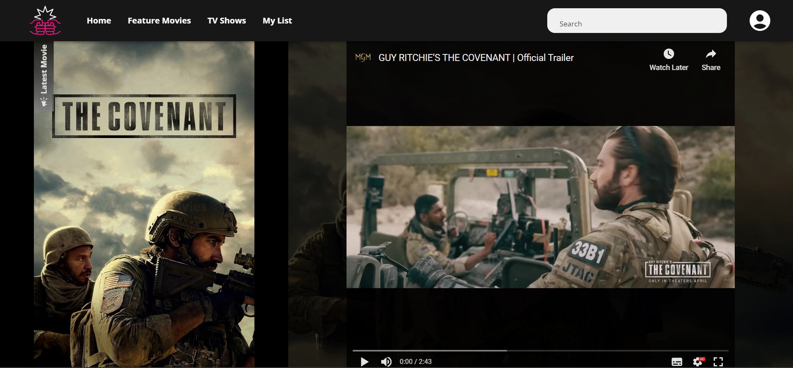

LOGIN PAGE

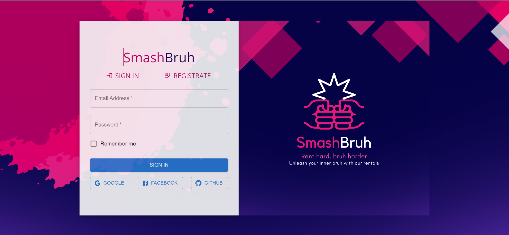

FEATURE MOVIES PAGE

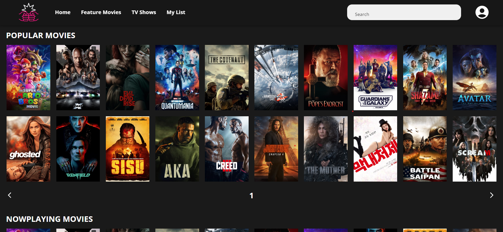

MOVIE PAGES

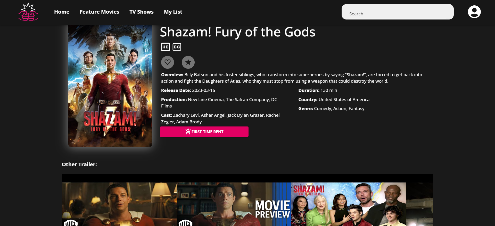

TV SHOWS PAGE

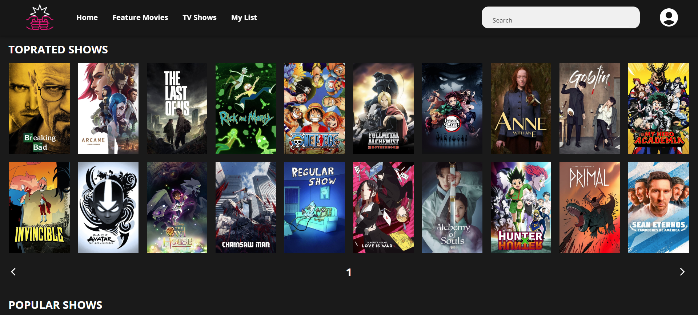

SHOW PAGES

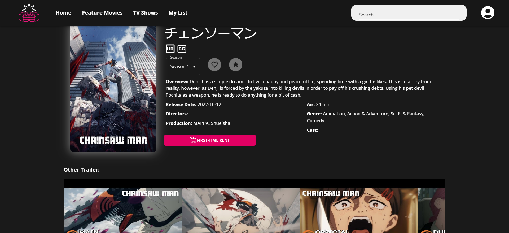

PROFILE PAGES

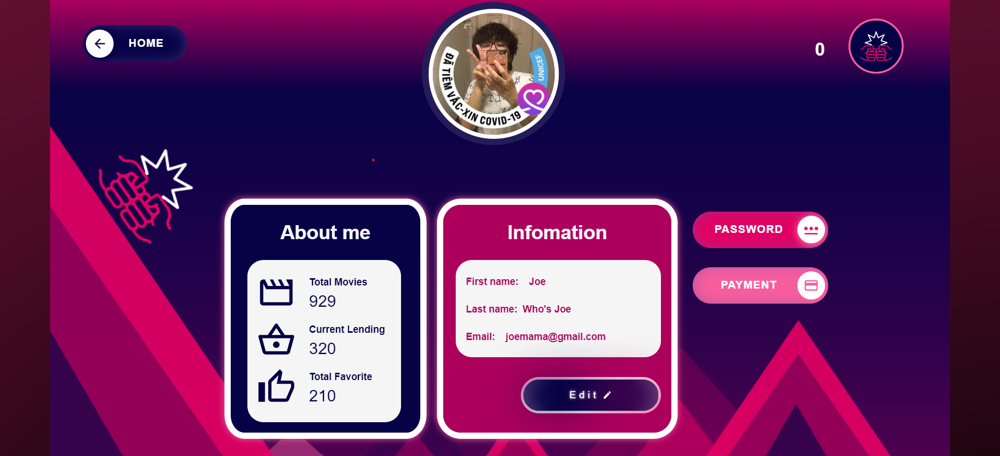

SEARCH PAGES

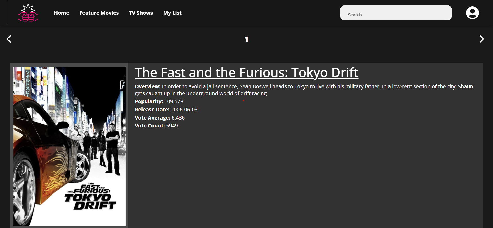

MY LIST PAGE WHEN NO INFORMATION

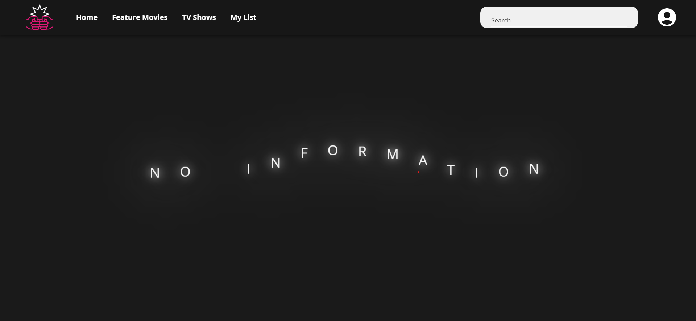

MY LIST PAGE WHEN HAVE INFORMATION

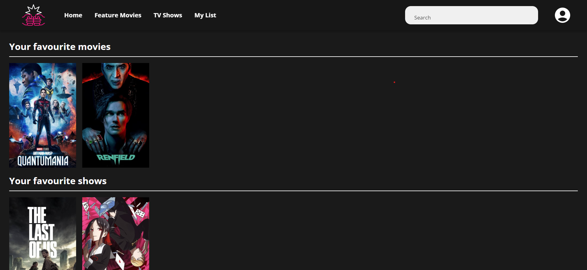

COLOR PALETTE

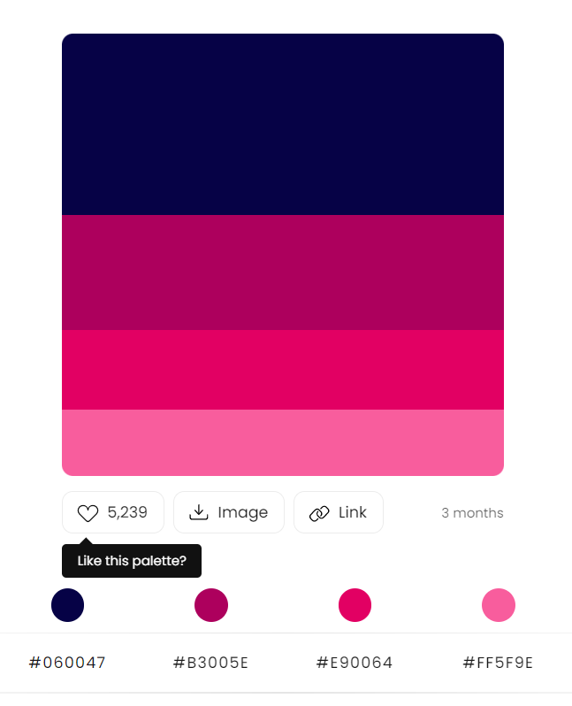

### **5.6. Functionality Design**

- **Key features:**

  - View movies/shows: display information of available movies/shows on the internet at the moment.
  - Favourite: press heart button and that movies/shows are stored inside collections of favourites of everything.
  - Rent: rent a movie or show for a period of time then the movie or show automatically disappear after the expiration day of the movie or show is exceeded.
  - Rate: rate a movie or show for a number of stars and it is stored on different database storage of individuals.

- **Other features:**
  - Search: find what users are interested in.
  - Admin: special feature only available for admin when log into our web application.
  - Recommendation: recommend based on the genres, cast, duration of movies or shows accessed at real-time by users.

## **6. Implementation**

### **6.1. Development Environment and Technology Stack**

The development of _SmashBruh_ Movie Renting Website requires a robust and efficient development environment to ensure the smooth creation and deployment of the platform. Here's an overview of the key components of the development environment:

- **_Programming Languages:_** JavaScript takes center stage in the development process of the _SmashBruh_ movie renting website. As a dynamic and versatile programming language, JavaScript empowers the website with interactivity and functionality. It enables features like seamless search functionality, dynamic recommendations, interactive elements, and smooth navigation. JavaScript's integration with backend APIs ensures efficient data retrieval and real-time updates. With JavaScript, in addition to HTML and CSS _SmashBruh_ delivers an immersive and user-centric movie renting experience.
- **_Frameworks and Libraries:_** By harnessing the power of Node.js, Express.js, React, and MUI, _SmashBruh_ leverages a comprehensive and modern tech stack. This combination enables efficient backend operations, seamless frontend interactivity, and visually stunning user interfaces, resulting in an immersive and enjoyable movie renting experience for users.
- **_Database Management System:_** MongoDB, a popular NoSQL database management system, serves as the foundation for storing and managing data in the _SmashBruh_ movie renting website. MongoDB offers a flexible and scalable approach to data storage, making it ideal for handling movie information, user profiles, rental history, and other pertinent data.
- **_Version Control System:_** With Git and GitLab, _SmashBruh_ benefits from features like branch management, version control, and the ability to roll back changes if needed. This combination ensures that the development team can work concurrently, seamlessly integrate new features, resolve conflicts, and track the evolution of the codebase.
- **_Development Tools and Integrated Development Environment (IDE):_** With its intuitive interface and customizable settings, developers working on _SmashBruh_ can personalize their coding environment according to their preferences. VS Code provides essential tools such as syntax highlighting, code completion, and linting, ensuring clean and error-free code. The built-in debugger enables efficient troubleshooting and debugging, helping to identify and fix issues quickly.
- **_Cloud Services:_** Leveraging cloud services can provide scalability, flexibility, and reliability to the website. Cloud platforms such as Amazon Web Services (AWS), Microsoft Azure, or Google Cloud can be utilized for hosting, storage, and managing infrastructure components.
- **_Security Measures:_** Implementing robust security measures is vital to safeguard user data and protect against potential threats. This includes secure coding practices, encryption techniques, user authentication mechanisms, and adherence to industry-standard security protocols.
- **_Continuous Integration and Deployment:_** Implementing a CI/CD (Continuous Integration/Continuous Deployment) pipeline ensures seamless integration of code changes, automated testing, and efficient deployment to staging and production environments.

By establishing a comprehensive development environment encompassing these components, _SmashBruh_ can ensure efficient development processes, high-quality code, and a scalable platform that meets the needs and expectations of movie enthusiasts.

## **7. User Guide**

### **7.1. Getting Started**

Getting Started Guide for _SmashBruh_ Movie Renting Website after launching Website:

1. **_Create an Account:_**
   To access all the features and benefits of _SmashBruh_, start by creating your account. Click on the "Sign Up" button on the homepage and provide the required information, including your name, email address, and a secure password. Once you've filled in the details, click "Finish" to proceed.

2. **_Explore Movie Catalog:_**
   After successfully creating your account, it's time to explore our extensive movie catalog. Navigate to the "Movies" section to discover a wide range of genres. Browse through the collections, popular releases, or use the search bar to find specific movies.

3. **_Select and Rent Movies:_**
   When you find a movie you want to rent, click on its title to access the movie details page. Here, you'll find a synopsis, cast and crew information, user reviews, and other relevant details. Click on "Rent" to proceed to the checkout.

4. **_Make Payment:_**
   At the checkout, review your selected movie and rental duration. _SmashBruh_ provides secure payment options. Choose your preferred payment method, enter the required details, and click "Smash" to finalize your rental.

5. **_Enjoy Your Movie:_**
   Once the payment is processed successfully, you'll receive a confirmation message along with access to the movie. Head to the "My Rentals" section, where you'll find all the movies you've rented.

6. **_Manage Your Account:_**
   _SmashBruh_ provides a user-friendly account management interface to help you keep track of your rentals, update your personal information, and manage your payment methods. Access the "My Profile" section to view and modify your profile, change your password, or update your payment details.

7. **_Explore Additional Features:_**
   While movie rentals are at the core of _SmashBruh_, we offer additional features to your movie-watching experience. Explore our curated playlists, personalized recommendations.

## **8. Conclusion**

### **8.1. Summary of Project**

In conclusion, our project is a small

### **8.2. Future Work**
- Due to the time constrain and limited experience working in a big project with a team, we find ourselves struggle to meet deadlines and fulfill our initial ideas and objectives. With that being said, we have come a long way and learned so much about web development and team working. And with those expierence, there are still objectives that we can do to further polish and perfect the app in the future. 

- **Admin's Interface**

  - Eventhough, we did implement an admin checking function and provide a work enviroment in the database for the admin, there are no Admin's interfaces for them to operate and moderate through. The interface may provides an overview of the users information and rental information. The admin may ban or unban a user, disable a certain movie for renting or viewing. There are endless of ways for the admins to operate and conduct their work.

- **Interactive Movie Discussion**

  - Introduce a feature where users can engage in discussions, comment on movies, and participate in forums or live chats with other movie enthusiasts.

- **Social Integration**

  - Integrate social media features that allow users to share their favorite movies, reviews, and recommendations with friends.

- **Augmented Reality (AR) Movie Posters**
  - Users can scan movie posters using their smartphones or tablets and access interactive content such as trailers, behind-the-scenes footage, or exclusive interviews with the cast and crew.

- **Recommendation System**

  - With the rise of AI in recent years, it is crucial to implement some sort of machine learning/AI algorithm to our app, not only for the sake of modernity but also the suffiency at providing our users the services. A recommendation system can learn from a user's favourite movies/shows collection and compute a certain metrics to determine what sort of movies/shows fit the user the best. Those metrics can be the genres, actors/actress, director or even the countries where they were produced.
### **8.3. References**

- Color Palette: https://colorhunt.co/palette/060047b3005ee90064ff5f9e
- GitLab: https://gitlab.com/galvdat/vgu_tinyprojects/pe2023/vgupe2023_team5
- MongoDB: https://www.mongodb.com/
- MUI Library: https://mui.com/material-ui/getting-started/overview/
- OAuth2: https://oauth.net/2/

©️ Vinh Nguyen Ngoc

