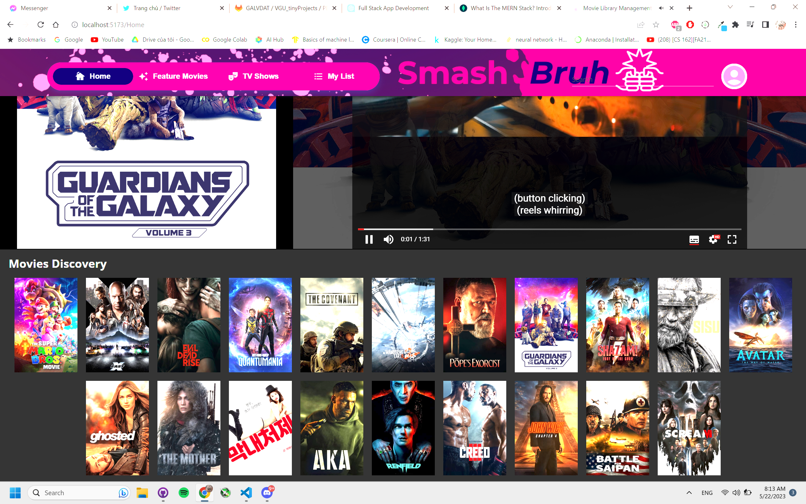
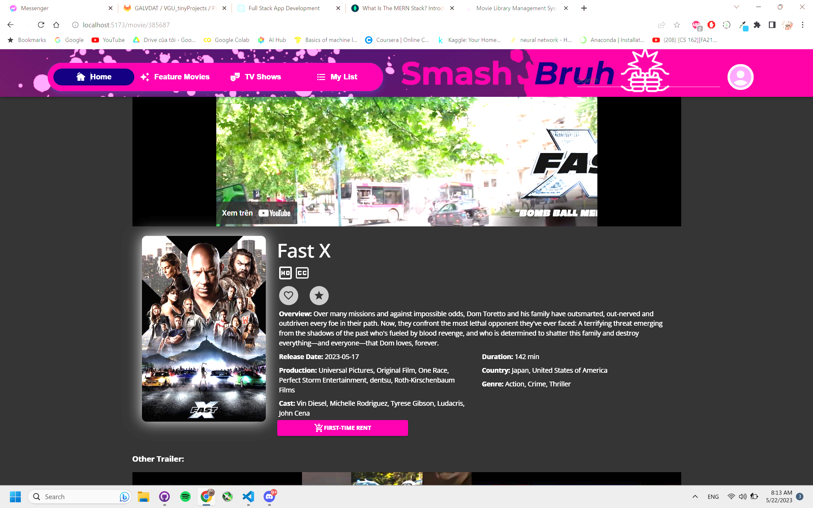
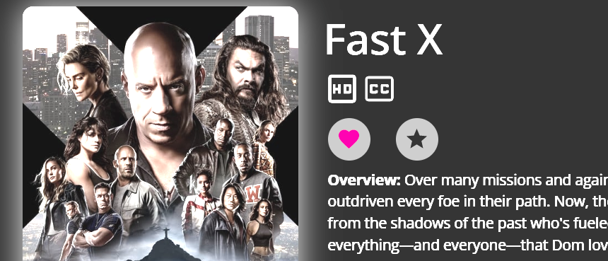
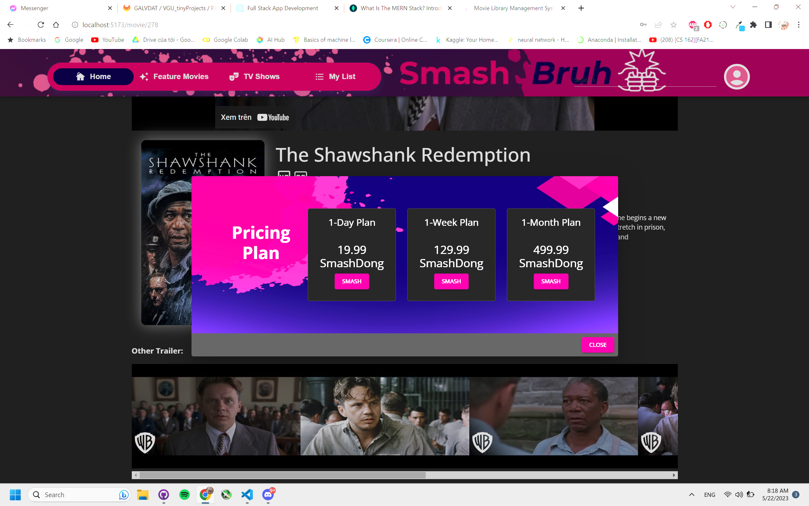
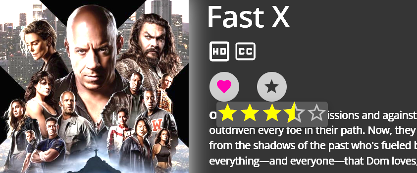
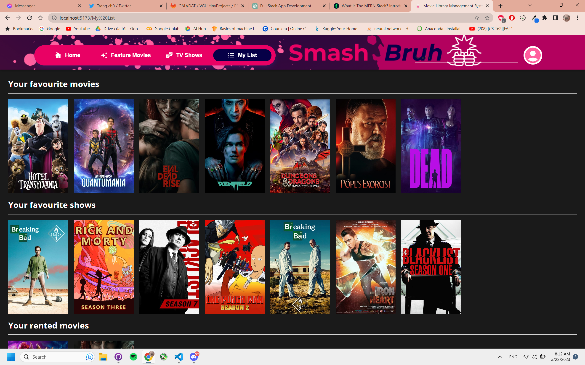
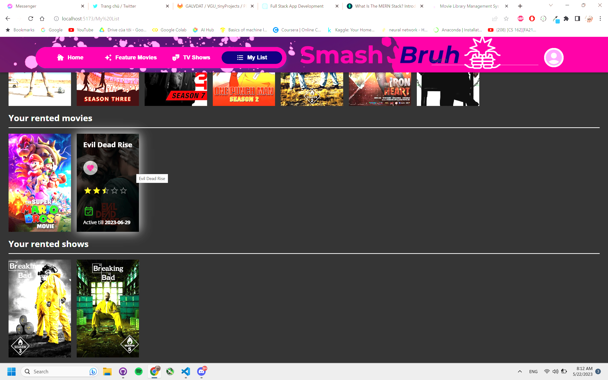
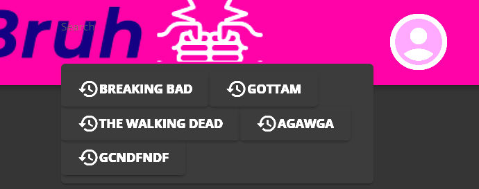
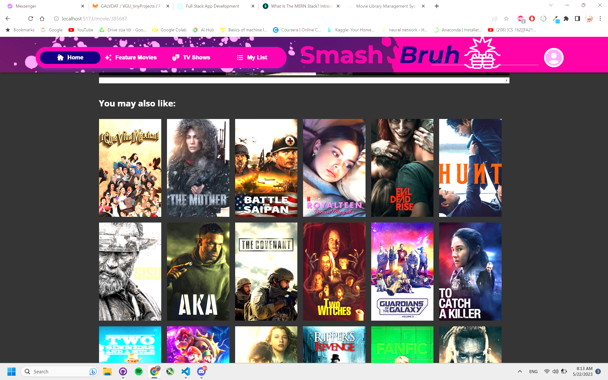
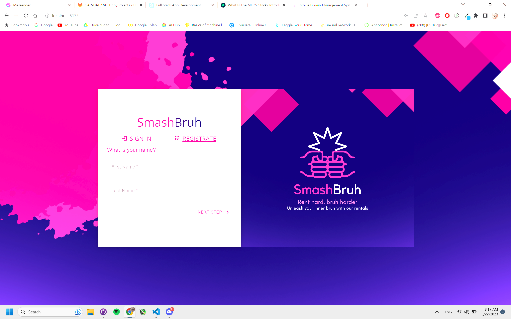

## 1. _SmashBruh_ Movie Renting Website - Documentation

### 1.1. Team member

| Full Name            | Student Id | Tasks                                                                                                                                                                                                  |     |
| -------------------- | :--------: | :----------------------------------------------------------------------------------------------------------------------------------------------------------------------------------------------------- | --- |
| Nguyễn Ngọc Vĩnh     |   18691    | _Movie and TV Shows details, trailers, and recommendations backend API; Movie Search and Filtering API; UI/UX of Homepage and MoviePage; Markdown and Swagger Documentation, Analytics and Reporting._ |     |
| Hà Quách Phú Thành   |   18840    | _Moderate and in charge of frontend and backend; Manage members work and meetings; configure CI/CD, pipeline and Docker development;_                                                                  |
| Thái Quang Nam       |   18770    | _Design UI for Navbar, HomePage, FeatureMoviePage, TVShowsPage, MyListPage, SearchPage; Markdown Documentation, Reporting_                                                                             |
| Phạm Hoàng Việt      |   18334    | _Design MoviePages and ShowPages ; Markdown Documentation, Reporting_ User Interface                                                                                                                   |
| Nguyễn Xuân Khang    |   18973    | _Set up Frontend and Backend ProfilePage; Markdown Documentation_                                                                                                                                      |
| Nguyễn Khắc Hoàng    |   18230    | _Overall UI, ProfilePage, Login/RegisterPage, AccountPage; Markdown Documentation, Reporting_                                                                                                          |
| Lê Duy               |   17434    | _Set up Email Verification, Security; Markdown Documentation; Reporting_                                                                                                                               |
| Trần Ngọc Duy Chương |   17197    | _Backend for OAuth2, Authentication; Markdown Documentation; Reporting_                                                                                                                                |

### 1.2. About our project

In an era dominated by media streaming platforms and social media, the virtual realm has become the primary avenue for various activities. However, traditional methods of buying or renting media, such as movies and TV shows, often involve frustrating in-person transactions. Moreover, managing and tracking favorite content across multiple limited streaming services can be complicated and confusing.

Now with our media rental web application, you can now keep track of rented movies and TV show, as well as keeping track of your favourites and rate them accordingly, provided to you with one of the largest movie database - The Movie Database (TMDB) - a free and open movie database for developers, which also acts as our main API for working with movies/shows.

### 1.3. Table of content

- [1. _SmashBruh_ Movie Renting Website - Documentation](#1-smashbruh-movie-renting-website---documentation)
  - [1.1. Team member](#11-team-member)
  - [1.2. About our project](#12-about-our-project)
  - [1.3. Table of content](#13-table-of-content)
- [2. Introduction](#2-introduction)
  - [2.1. Project Overview](#21-project-overview)
  - [2.2. Objective](#22-objective)
- [3. System Analysis](#3-system-analysis)
  - [3.1. Business Requirements](#31-business-requirements)
  - [3.2. User Requirements](#32-user-requirements)
  - [3.3. Functional Requirements](#33-functional-requirements)
  - [3.4. Non-Functional Requirements](#34-non-functional-requirements)
- [4. System Design](#4-system-design)
  - [4.1. System Diagrams](#41-system-diagrams)
  - [4.2. System Architecture](#42-system-architecture)
    - [4.2.1. MVC Models for Web Development](#421-mvc-models-for-web-development)
  - [4.3. Components Design](#43-components-design)
    - [4.3.1. Users Interface:](#431-users-interface)
    - [4.3.2. Authentication Interface:](#432-authentication-interface)
  - [4.4. Structure and Relationships](#44-structure-and-relationships)
  - [4.5. Data Model](#45-data-model)
  - [4.6. GUI](#46-gui)
  - [4.7. Functionality Design](#47-functionality-design)
- [5. Implementation](#5-implementation)
  - [5.1. File Structure](#51-file-structure)
  - [5.2. Development Environment and Technology Stack](#52-development-environment-and-technology-stack)
  - [5.3. CI/CD Testing and Docker](#53-cicd-testing-and-docker)
  - [5.4. Deployment](#54-deployment)
  - [5.5. API Utilization](#55-api-utilization)
    - [5.5.1. Movies](#551-movies)
    - [5.5.2. TV Shows](#552-tv-shows)
    - [5.5.3. Discovery](#553-discovery)
- [6. User Guide](#6-user-guide)
  - [6.1. Getting Started](#61-getting-started)
- [7. Conclusion](#7-conclusion)
  - [7.1. Summary of Project](#71-summary-of-project)
  - [7.2. Future Work](#72-future-work)
  - [7.3. References](#73-references)

## 2. Introduction

### 2.1. Project Overview

_SmashBruh_ is an movie rental web application that aims to simplify the way people discover and rent movies. Our project aims to provide options for users to view the information related to movies and shows. They also have the choice to choose which movies or shows to rent and have their rented information saved for later use. The web app also allows users to perform actions such as liking and rating, which can be viewed, easily accessed and managed.

### 2.2. Objective

- _Extensive Movie Library:_ Curate a diverse collection of films across genres, eras, and cultures to cater to the varied preferences of our users. From classic masterpieces to the latest releases, ensure a wide range of options that cover different cinematic experiences.

- _User-Friendly Interface:_ Develop an intuitive and easy-to-navigate website interface that allows users to seamlessly explore and discover movies. Implement robust search functionality, filters, and sorting options to facilitate effortless movie browsing.

- _Detailed Movie Information:_ Provide comprehensive and accurate movie information to assist users in making informed decisions. Include detailed descriptions, plot summaries, cast and crew details, user ratings, and reviews to give users valuable insights into each film.

- _Personalized Recommendations:_ Implement a sophisticated recommendation system that analyzes user preferences on the movies and shows currently accessed. Generate personalized movie suggestions that align with users' tastes, helping them discover new films and broaden their cinematic horizons.

- _Easy Rental Process:_ Streamline the movie rental process to make it convenient and hassle-free for users. Implement a straightforward rental system where users can choose their desired movies, rental duration, and complete secure online payments.

## 3. System Analysis

### 3.1. Business Requirements

The business requirements of _SmashBruh_ are as follows:

- _Broad Selection of Content:_ Users expect a wide variety of movies and TV shows across different genres, including popular releases, classics, and niche titles. They want access to a diverse library that caters to their individual preferences and interests.
- _User Account Management:_ _SmashBruh_ requires a user account management system to allow users to create profiles, save preferences, manage their watch lists, and track their searching history. This feature provides a personalized experience and enables users to easily access and organize their preferred content.
- _Cross-Platform Accessibility:_ _SmashBruh_ should be accessible across different devices and platforms, including web browsers, mobile devices, and smart TVs. This ensures that users can enjoy their favorite content conveniently, regardless of the device they are using.
- _Analytics and Reporting:_ The platform requires robust analytics and reporting capabilities to track user behavior, content popularity, and performance metrics. These insights help in making data-driven decisions, improving the user experience, and optimizing the content library.

By fulfilling these business requirements, _SmashBruh_ can create a user-friendly interface, up-to-date information and a stable searching and recommendation system inside the rental movie system to maintain the flow of the website.

### 3.2. User Requirements

The user requirements of _SmashBruh_ are as follows:

- _First Time User Experience:_ _SmashBruh_ provides visitors latest movie that the system have to offer and other information of available movies and shows ath the moment so that the system keeps up with user's interest.
- _Efficient Search and Filtering:_ Users require an efficient search functionality that allows them to search for specific titles, genres, actors, directors, or keywords. They also expect advanced filtering options to refine their search results based on criteria such as release year, ratings, and language.
- _Movie Information Based Recommendations:_ Users appreciate personalized recommendations based on their current accessed movies and shows. It could be based on names, genres, cast.
- _Ratings:_ Users value the ability to read and contribute to ratings. They want a platform that encourages user feedback, enabling them to make informed decisions and engage in discussions with other movie enthusiasts.
- _Flexible Rental Options:_ Users prefer flexible rental options, including various pricing plans with understandable cost to spend. They want the freedom to choose the rental plan that suits their preferences and viewing habits.
- _Cross-Platform Compatibility:_ Users want the flexibility to access _SmashBruh_ on multiple devices, including web browsers, smartphones, tablets, and smart TVs. They expect a seamless experience that allows them to pick up where they left off across different devices.
- Simple Payment Processing:\_ Users don't have to worry about payment system because we uses simple calculation (addtion, subtraction, multiplication and division) based on what users have chosen to be their pricing plan mentioned in the previous part.

By addressing these user requirements, _SmashBruh_ can provide a user-centric experience that meets the expectations of movie enthusiasts, offering them a vast selection of content, seamless navigation and personalized recommendations.

### 3.3. Functional Requirements

The functional requirements of _SmashBruh_ are as follows:

- _User Registration and Account Management:_
  - Users should be able to create an account and provide necessary information.
  - Users should be able to log in securely and manage their account settings.
- _Content Catalog and Search:_
  - The platform should maintain a comprehensive catalog of movies and TV shows.
  - Users should be able to search for content by title.
  - Advanced filtering options should be available to refine search results.
- _Movie and TV Show Details:_
  - Users should be able to view detailed information about each movie or TV show, including synopsis, cast, director, ratings, and reviews.
  - The platform should display relevant recommendations and similar content.
- _Rental Options:_
  - Users should be able to select rental pricing plans.
  - The platform should provide pricing details, rental durations, and availability information.
- _Payment Processing:_
  - The platform should securely process payments using simple calculations.
  - Users should receive a decreasing amount of money in their net balance
- My list and Favourites:\_
  - Users should be able to create and manage a watch list of movies and TV shows.
  - The platform should provide personalized recommendations based on user preferences and ratings.
- _Ratings:_
  - Users should be able to rate stars score for movies and TV shows.
  - The platform should display average ratings and aggregate reviews for each title.
- _Analytics and Reporting:_
  - The platform should collect and analyze data to generate insights on user behavior, content popularity, and platform performance.

### 3.4. Non-Functional Requirements

The non-functional requirements of _SmashBruh_ are as follows:

- _Performance:_
  - The platform should have fast loading times and responsive navigation to provide a seamless user experience.
- _Scalability and Availability:_
  - The platform should be designed to handle a growing user base and increasing traffic without compromising performance.
  - It should be scalable to accommodate a large number of concurrent users and a growing content library.
  - The platform should have a high level of availability, minimizing downtime and ensuring users can access the service whenever they need it.
  - Measures such as redundancy, load balancing, and backup systems should be in place to maintain availability.
- _Security:_
  - The platform should implement robust security measures to protect users' personal information, payment details, and viewing history.
  - Secure encryption protocols should be used to ensure the confidentiality and integrity of data.
- _Compatibility:_
  - The platform should be compatible with various operating systems, web browsers, and devices to accommodate a wide range of user preferences.
  - It should adapt to different screen sizes and resolutions, providing a consistent and optimized experience across devices.
- _Usability:_
  - The platform should have a user-friendly and intuitive interface, making it easy for users to navigate, search for content, and manage their account.
  - Clear and concise instructions and tooltips should be provided to guide users through different features and functionalities.
- _Data Privacy:_
  - The platform should comply with data protection regulations and ensure the privacy of user data.
  - Clear privacy policies and consent mechanisms should be in place, informing users about data collection, storage, and usage practices.
- _Performance Monitoring and Optimization:_
  - The platform should have monitoring mechanisms in place to track performance metrics, identify bottlenecks, and optimize system performance.
  - Regular performance testing and optimization should be conducted to ensure optimal user experience.
- _Cross-Platform Accessibility:_
  - The platform should be accessible across devices and platforms, including web browsers, mobile devices, and smart TVs.

## 4. System Design

### 4.1. System Diagrams

_Use Cases_

User Use Case Diagrams


_Sequence_

- Admin Sequence
  

- User Sequence
  

_Database_


### 4.2. System Architecture

#### 4.2.1. MVC Models for Web Development

_The Model-View-Controller (MVC)_ architecture is a popular design pattern used in the development of software applications. In the context of a movie rental app, the MVC architecture provides a structured and organized approach to manage the different components of the application.

- _The Model_ component of the movie rental app represents the data and the business logic. It encapsulates entities such as movies, users, rentals, and other related data. The Model component includes the data access layer, which interacts with the underlying database or data storage system to perform operations like retrieving, creating, updating, and deleting data. The Model also handles business logic operations, such as validating user inputs, managing rental transactions, integrating with external APIs for fetching movie information, and enforcing data integrity.

- _The View_ component in the movie rental app is responsible for presenting the user interface to the users. It encompasses all the visual elements and user experience components of the application. The View component includes screens, forms, buttons, and other user interface elements that allow users to browse movies, search for movies based on different criteria, view detailed movie information, manage their rental queue, and interact with the application. The View component is designed to be visually appealing, intuitive, and responsive to enhance the overall user experience.

- _The Controller_ component acts as the intermediary between the Model and the View. It receives user input from the View, processes it, and interacts with the Model to fetch or update the data accordingly. The Controller component handles tasks such as processing user requests, managing user authentication and authorization, managing rental transactions, coordinating the flow of data between the Model and the View, and triggering appropriate actions based on user interactions. It ensures that the user input is validated and appropriately acted upon, orchestrating the overall functionality and behavior of the movie rental app.

By adopting the _MVC architecture_, the movie rental app achieves modularity, code reusability, and easier maintenance. The separation of concerns enables developers to work independently on different components, allowing for better collaboration and development efficiency. Changes in one component can be made without affecting the others, making it easier to test, debug, and enhance specific parts of the application. Moreover, the MVC architecture promotes scalability and extensibility, as new features or modifications can be incorporated without disrupting the existing functionality, facilitating the continuous evolution of the movie rental app to meet the changing needs of its users.

### 4.3. Components Design

#### 4.3.1. Users Interface:

- _Users are able to access:_
  - Home Page
  - Feature Movies Page
  - Movie Pages
  - TV Shows Page
  - Show Pages
  - Profile Pages
  - Login/Register Pages
  - Search Page

#### 4.3.2. Authentication Interface:

The authentication interface and features of _SmashBruh_ are as follows:

- _Oauth2 and cookie based authentication:_
  - In order to streamline the registration process even further, _SmashBruh_ has also implements the Open Authorization 2.0 protocol(Oauth2).
  - _SmashBruh_ Oauth2 implements support registering using other well known platform such as Google, GitHUb and Facebook, providing a near instant registering experience.
  - To further increase security, _SmashBruh_ also implements a variant cookies based authentication.
  - The token is hashed and saved to the database to prevent cookie forging, the token is hashed and set using the bcrypt and jwt library.

### 4.4. Structure and Relationships

- _User_: A user can have many rentals (one-to-many relationship)

- _Movie_ - Show: A movie can be associated with one rental (one-to-one relationship)

- _Rental_: A rental belongs to a user (many-to-one relationship) and a movie (many-to-one relationship)

- _Favourite_: A movie can be favourited by many users (one-to-many relationship)

- _Rating_: A movie can be rated by many users (one-to-many relationship)

- _History_: A user can have many searched strings, and a searched string can belong to many users (many-to-many relationship)

### 4.5. Data Model

| Schema             | Attributes                                                                                            |
| ------------------ | :---------------------------------------------------------------------------------------------------- |
| User               | firstName, lastName, password, picturePath, verified, balance, token, isAdmin, FbId, GgId, TwId, GhId |
| UserFavouriteMovie | userID, movieID, media_type, season                                                                   |
| UserRateMovie      | userID, movieID, rating, media_type, season                                                           |
| UserRentMovie      | userID, movieID, rentalBeginDate, rentalExpireDate, media_type, season                                |
| UserRateMovie      | userID, movieID, rating, media_type, season                                                           |
| UserSearchHistory  | userID, searchedString, createdAt                                                                     |
|                    |                                                                                                       |

### 4.6. GUI

HOME PAGE


LOGIN PAGE


FEATURE MOVIES PAGE


MOVIE PAGES


TV SHOWS PAGE


SHOW PAGES


PROFILE PAGES


SEARCH PAGES


MY LIST PAGE WHEN NO INFORMATION


MY LIST PAGE WHEN HAVE INFORMATION


COLOR PALETTE


### 4.7. Functionality Design

- Key features:

  - _View movies/shows_: display information of available movies/shows on the internet at the moment.






- _Favourite_: press heart button and that movies/shows are stored inside collections of favourites of everything.



- Rent: rent a movie or show for a period of time then the movie or show automatically expires after the expiration day of the movie or show is exceeded.



- _Rate_: rate a movie or show for a number of stars and it is stored in the database storage of individuals.



- _My list_: where you can view your liked movies or tv shows




- Other features:
  - _Search and History searched_: find what users are interested in and what you searched will remain in your history up to 5 most recent searches:



- _Recommendation_: recommend based on the genres, cast of movies or shows accessed at real-time by users on any given movie and show page.



## 5. Implementation

### 5.1. File Structure

```
C:.
|   .gitlab-ci.yml
|   package-lock.json
|   README.md
|
+---documents
|   |   Database Diagram.png
|   |   file_structure.txt
|   |   report.md
|   |
|   +---Images
|   |       ColorPalette.png
|   |       FeatureMoviePage.png
|   |       HomePage.png
|   |       InfoMyList.png
|   |       LoginPage.png
|   |       MoviePage.png
|   |       NoInfoMyList.png
|   |       ProfilePage.png
|   |       SearchPage.png
|   |       ShowPage.png
|   |       TVShowsPage.png
|   |
|   +---Sequence
|   |       Admin Sequence Diagrams.png
|   |       User Sequence Diagrams.png
|   |
|   \---Use Cases
|       \---User
|               1. Sign Up Use Case.docx
|               2. Sign In Use Case.docx
|               3. Choose Movie Use Case.docx
|               4. Search Use Case.docx
|               User Use Case Diagrams.png
|
+---server
|   |   .babelrc
|   |   .dockerignore
|   |   .env
|   |   .env.example
|   |   .gitignore
|   |   Dockerfile
|   |   index.js
|   |   package-lock.json
|   |   package.json
|   |
|   +---config
|   |       ViewEngine.js
|   |
|   +---controller
|   |       auth.js
|   |       movieAPI.js
|   |       oAuth2_Controller.js
|   |       SampleController.js
|   |       user.js
|   |       UserFavouriteMovie_Controller.js
|   |       UserRateMovie_Controller.js
|   |       UserRentMovie_Controller.js
|   |       UserSearchHistory_Controller.js
|   |
|   +---middleware
|   |       auth.js
|   |       CheckRental.js
|   |       FileUploader.js
|   |
|   +---models
|   |       EmailVerification_Schema.js
|   |       oAuth2_model.js
|   |       sample.js
|   |       UserFavouriteMovie_Model.js
|   |       UserFavouriteMovie_Schema.js
|   |       UserRateMovie_Model.js
|   |       UserRateMovie_Schema.js
|   |       UserRentMovie_Model.js
|   |       UserRentMovie_Schema.js
|   |       UserSearchHistory_Model.js
|   |       UserSearchHistory_Schema.js
|   |       User_Schema.js
|   |
|   +---public
|   |   \---assets
|   |           307860482_775538183513924_2015211704355308618_n.jpg
|   |           332081131_1973766242961950_6825159385800828004_n.jpg
|   |           blood.png
|   |           images.jpg
|   |
|   +---routes
|   |       WebRoutes.js
|   |
|   \---__test__
|           mock_TMDB.js
|           webRoutes.test.js
|
\---views
    |   api.yaml
    |   package-lock.json
    |   verified.html
    |
    +---React
    |   |   .babelrc
    |   |   .dockerignore
    |   |   .env
    |   |   .gitignore
    |   |   Dockerfile
    |   |   index.html
    |   |   jsconfig.json
    |   |   package-lock.json
    |   |   package.json
    |   |   vite.config.js
    |   |
    |   |
    |   +---src
    |   |   |   App.css
    |   |   |   App.jsx
    |   |   |   index.css
    |   |   |   main.jsx
    |   |   |   theme.js
    |   |   |
    |   |   +---assets
    |   |   |   |   Color Hunt Palette 060047b3005ee90064ff5f9e.png
    |   |   |   |
    |   |   |   +---image
    |   |   |   |       accountBox.png
    |   |   |   |       backgroundNavpage.png
    |   |   |   |       backgroundNavPage2.png
    |   |   |   |       backgroundNavPage3.png
    |   |   |   |       bob.png
    |   |   |   |       Buy1000.png
    |   |   |   |       Buy1500.png
    |   |   |   |       Buy2000.png
    |   |   |   |       Buy300.png
    |   |   |   |       Buy3000.png
    |   |   |   |       Buy600.png
    |   |   |   |       Demo.png
    |   |   |   |       demo2-1.png
    |   |   |   |       demo2.png
    |   |   |   |       demo3.png
    |   |   |   |       demo4.png
    |   |   |   |       demo5.png
    |   |   |   |       demo6.png
    |   |   |   |       demo7.png
    |   |   |   |       movieBox.png
    |   |   |   |       navbarCover.png
    |   |   |   |       navbarCover2.png
    |   |   |   |       PaymentBackground.png
    |   |   |   |       PaymentCover.png
    |   |   |   |       profileBackground.png
    |   |   |   |       ProfileBehind.png
    |   |   |   |       profileBox.png
    |   |   |   |       profileBox2.png
    |   |   |   |       profileBox3.png
    |   |   |   |       profileBox4.png
    |   |   |   |       profileBox5.png
    |   |   |   |       profileBox6.png
    |   |   |   |       profileBox7.png
    |   |   |   |       profileBox8.png
    |   |   |   |       profileCover.jpg
    |   |   |   |       profileCover2.jpg
    |   |   |   |       profileCover3.png
    |   |   |   |       profileCoverBot.png
    |   |   |   |       profileCoverBot2.png
    |   |   |   |       profileCoverBot3.png
    |   |   |   |       profileCoverBot4.png
    |   |   |   |       profileCoverBot5.png
    |   |   |   |       profileCoverBot6.png
    |   |   |   |       SmashDong.png
    |   |   |   |       SmashDong1000.png
    |   |   |   |       SmashDong1500.png
    |   |   |   |       SmashDong2000.png
    |   |   |   |       SmashDong300.png
    |   |   |   |       SmashDong3000.png
    |   |   |   |       SmashDong600.png
    |   |   |   |
    |   |   |   \---images
    |   |   |           background.png
    |   |   |           card.png
    |   |   |           Logo.png
    |   |   |           logoCard.png
    |   |   |           logoCard2.png
    |   |   |           logoCard3.png
    |   |   |           logoCard4.png
    |   |   |           SmashBruh.png
    |   |   |           test.jpg
    |   |   |           textLogo.png
    |   |   |
    |   |   +---components
    |   |   |       FlexBetween.jsx
    |   |   |       Loading.jsx
    |   |   |       ScreenSpinner.jsx
    |   |   |       UserImage.jsx
    |   |   |
    |   |   +---scenes
    |   |   |   +---featurePage
    |   |   |   |       featureCard.jsx
    |   |   |   |       featureList.jsx
    |   |   |   |       index.jsx
    |   |   |   |
    |   |   |   +---homePage
    |   |   |   |       Carousel.jsx
    |   |   |   |       HomeList.jsx
    |   |   |   |       index.jsx
    |   |   |   |       MovieCard.jsx
    |   |   |   |       ShowDiscoveryCard.jsx
    |   |   |   |
    |   |   |   +---loginPage
    |   |   |   |       index.jsx
    |   |   |   |       NewDesign.jsx
    |   |   |   |
    |   |   |   +---moviePage
    |   |   |   |       index.jsx
    |   |   |   |
    |   |   |   +---mylistPage
    |   |   |   |       index.jsx
    |   |   |   |
    |   |   |   +---navbar
    |   |   |   |       IconListComponent.jsx
    |   |   |   |       index.jsx
    |   |   |   |       SearchBar.jsx
    |   |   |   |       Searchbar2.jsx
    |   |   |   |
    |   |   |   +---profilePage
    |   |   |   |   |   EmailVerifyDialog.jsx
    |   |   |   |   |   index.jsx
    |   |   |   |   |   NewDesign.jsx
    |   |   |   |   |   Original.jsx
    |   |   |   |   |   PaymentDialog.jsx
    |   |   |   |   |   ProfileSection.jsx
    |   |   |   |   |   StarAnimation.jsx
    |   |   |   |   |   UserImage.jsx
    |   |   |   |   |
    |   |   |   |   \---PurchaseCard
    |   |   |   |           PurchaseCard.jsx
    |   |   |   |           PurchaseCard2.jsx
    |   |   |   |           PurchaseCard3.jsx
    |   |   |   |           PurchaseCard4.jsx
    |   |   |   |           PurchaseCard5.jsx
    |   |   |   |           PurchaseCard6.jsx
    |   |   |   |
    |   |   |   +---searchPage
    |   |   |   |       index.jsx
    |   |   |   |
    |   |   |   +---showPage
    |   |   |   |       index.jsx
    |   |   |   |
    |   |   |   +---trailerPlayer
    |   |   |   |       carouselVideo.jsx
    |   |   |   |       YoutubeVideo.jsx
    |   |   |   |
    |   |   |   \---tvPage
    |   |   |           index.jsx
    |   |   |           tvCard.jsx
    |   |   |           tvList.jsx
    |   |   |
    |   |   \---states
    |   |           index.js
    |   |
    |   \---__test__
    |           profile.test.js
    |
    \---Sample
            test.ejs
```

### 5.2. Development Environment and Technology Stack

The development of _SmashBruh_ Movie Renting Website requires a robust and efficient development environment to ensure the smooth creation and deployment of the platform. Here's an overview of the key components of the development environment:

- _Programming Languages:_ JavaScript takes center stage in the development process of the _SmashBruh_ movie renting website. As a dynamic and versatile programming language, JavaScript empowers the website with interactivity and functionality. It enables features like seamless search functionality, dynamic recommendations, interactive elements, and smooth navigation. JavaScript's integration with backend APIs ensures efficient data retrieval and real-time updates.
- _Frameworks and Libraries:_
  We decided to use a combination of libaries and database to assist us in implementing the app. The combination or MERN stack, consists of Node.js - a premier JavaScript web server, Express.js - a Node.js web framework, React - a client-side JavaScript framework and MongoDB - a document database. The middle or application tier of our system is built using Express and Node. Express.js serves as the server-side web framework, while Node.js acts as the robust and widely adopted JavaScript server platform. Together, these technologies form a powerful foundation for developing and delivering web applications. Express provides a streamlined and efficient framework for handling web requests and managing routes, while Node enables the execution of server-side JavaScript code, allowing for scalable and high-performance server applications.
- _Database Management System:_
  MongoDB, a popular NoSQL database management system, serves as the foundation for storing and managing data in the _SmashBruh_ movie renting website. MongoDB offers a flexible and scalable approach to data storage, making it ideal for handling movie information, user profiles, rental history, and other pertinent data.
- _Version Control System:_
  With Git and GitLab, _SmashBruh_ benefits from features like branch management, version control, and the ability to roll back changes if needed. This combination ensures that the development team can work concurrently, seamlessly integrate new features, resolve conflicts, and track the evolution of the codebase.
- _Development Tools and Integrated Development Environment (IDE):_ With its intuitive interface and customizable settings, developers working on _SmashBruh_ can personalize their coding environment according to their preferences. VS Code provides essential tools such as syntax highlighting, code completion, and linting, ensuring clean and error-free code. The built-in debugger enables efficient troubleshooting and debugging, helping to identify and fix issues quickly.
- _Cloud Services:_ Leveraging cloud services can provide scalability, flexibility, and reliability to the website. We were able to achieve by using Vercel - a serverless platform for static and hybrid applications.
- _Security Measures:_ Implementing robust security measures is vital to safeguard user data and protect against potential threats. This includes secure coding practices, encryption techniques, user authentication mechanisms, and adherence to industry-standard security protocols.
- _Continuous Integration and Deployment:_ With the help of GitLab, our implementation of CI/CD (Continuous Integration/Continuous Deployment) pipeline ensures integration of code changes, automated testing, and efficient deployment to staging and production environments.

By establishing a comprehensive development environment encompassing these components, _SmashBruh_ can ensure efficient development processes, high-quality code, and a scalable platform that meets the needs and expectations of clients

### 5.3. CI/CD Testing and Docker

Continuous Integration and Continuous Deployment (CI/CD) testing is a crucial aspect of software development and deployment processes. In the context of SmashBruh, CI/CD testing plays a vital role in ensuring the reliability and stability of the website's codebase before it is deployed to production.

To facilitate efficient and consistent testing, Docker containers are employed within the CI/CD pipeline of SmashBruh. Docker allows for the creation of isolated and reproducible environments that encapsulate the necessary dependencies and configurations required for testing the application. By utilizing Docker, SmashBruh can achieve consistency across different testing stages, ensuring that the application behaves consistently across various environments.

The CI/CD pipeline incorporates a series of automated tests, such as unit tests, integration tests, and end-to-end tests, to verify the functionality, performance, and compatibility of the website. These tests help identify and address any potential bugs, issues, or regressions early in the development cycle, enabling rapid feedback and iterative improvements.

By leveraging CI/CD testing and Docker, SmashBruh benefits from a streamlined and reliable deployment process. Code changes are automatically tested, and if the tests pass successfully, the updated code is deployed to the production environment. This automated approach minimizes human error, reduces the time required for manual testing, and ensures a more efficient release cycle.

### 5.4. Deployment

The deployment process is a critical phase in the lifecycle of SmashBruh, as it involves making the website accessible to its users. During deployment, the latest tested and approved version of the application is released to the production environment, allowing users to access the updated features and improvements.

To ensure a smooth deployment process, SmashBruh utilizes a structured deployment strategy. This strategy involves careful planning and coordination to minimize disruptions and downtime for users. It may include techniques such as rolling deployments, blue-green deployments, or canary releases, depending on the specific requirements of the website.

The deployment process also involves considerations for scalability, availability, and load balancing. SmashBruh aims to provide a seamless user experience even during periods of high traffic, and therefore employs strategies to distribute the workload efficiently across multiple servers or instances.

Monitoring and logging mechanisms are integrated into the deployment process to track and analyze the performance of the deployed application. This allows for real-time insights into system health, error tracking, and performance optimization.

Through an effective deployment process, SmashBruh ensures that updates and enhancements are rolled out to users in a controlled and reliable manner, providing a stable and continuously improving movie rental experience.

### 5.5. API Utilization

#### 5.5.1. Movies

| API                | Purpose                                                                                           | Request Type | Parameter      |
| ------------------ | ------------------------------------------------------------------------------------------------- | ------------ | -------------- |
| getDetail          | allows you to retrieve detailed information about a movie based on its unique movieID.            | GET          | movieID        |
| getTrailerID       | allows you to retrieve the trailer ID(s) of a movie based on its unique movieID.                  | GET          | movieID        |
| getRecommendations | allows you to retrieve movie recommendations based on a specific movie identified by its movieID. | GET          | movieID        |
| getMovieCredits    | allows you to retrieve the credits or cast information of a movie based on its unique movieID.    | GET          | movieID        |
| getList            | allows you to retrieve a list of movies based on a specified category.                            | GET          | category, page |
|                    |                                                                                                   |              |

#### 5.5.2. TV Shows

| API                    | Purpose                                                                                        | Request Type | Parameter      |
| ---------------------- | ---------------------------------------------------------------------------------------------- | ------------ | -------------- |
| getShowDetail          | allows you to retrieve detailed information about a tv show based on its unique showID.        | GET          | showID         |
| getShowTrailerID       | API endpoint allows you to retrieve the trailer ID(s) of a show based on its unique showID.    | GET          | showID         |
| getShowRecommendations | allows you to retrieve show recommendations based on a specific show identified by its showID. | GET          | showID         |
| getShowCredits         | allows you to retrieve the credits or cast information of a show based on its unique showID.   | GET          | showID         |
| getShowList            | allows you to retrieve a list of tv shows based on a specified category.                       | GET          | category, page |
|                        |                                                                                                |              |

#### 5.5.3. Discovery

| API               | Purpose                                                                                                           | Request Type | Parameter |
| ----------------- | ----------------------------------------------------------------------------------------------------------------- | ------------ | --------- |
| getMovieDiscovery | allows you to retrieve a list of movies based on discovery parameters, enabling users to discover popular movies. | GET          | page      |
| getShowDiscovery  | allows you to retrieve a list of tv shows based on discovery parameters, enabling users to discover top shows.    | GET          | page      |
| getImageCarousel  | allows you to retrieve a list of movies suitable for displaying in an image carousel or slideshow                 | GET          | 🚫        |
| getAnimeDiscovery | allows you to retrieve a list of anime based on discovery parameters, enabling users to discover popular anime.   | GET          | page      |
|                   |                                                                                                                   |              |

## 6. User Guide

### 6.1. Getting Started

Getting Started Guide for _SmashBruh_ Movie Renting Website after launching Website:

1. _Create an Account:_
   To access all the features and benefits of _SmashBruh_, start by creating your account. Click on the "Sign Up" button on the homepage and provide the required information, including your name, email address, and a secure password. Once you've filled in the details, click "Finish" to proceed.

 2. _Explore Movie Catalog:_
After successfully creating your account, it's time to explore our extensive movie catalog. Navigate to the "Feature Movies" or "Shows" section to discover a wide range of genres. Browse through the collections, popular releases, or use the search bar to find specific movies.


3. _Select and Rent Movies:_
   When you find a movie you want to rent, click on its title to access the movie details page. Here, you'll find a synopsis, cast and crew information, user reviews, and other relevant details. Click on "Rent" to proceed to the checkout. You can also "favourite" a movie and rate them with the corresponding icons.


4. _Make Payment:_
   At the checkout, review your selected movie and rental duration. _SmashBruh_ provides secure payment options. Choose your preferred payment method, enter the required details, and click "Smash" to finalize your rental.

 5. _Enjoy Your Movie:_
Once the payment is processed successfully, you'll receive a confirmation message along with access to the movie. Head to the "My Rentals" section, where you'll find all the movies you've rented.

6. _Manage Your Account:_
   _SmashBruh_ provides a user-friendly account management interface to help you keep track of your rentals, update your personal information, and manage your payment methods. Access the "My Profile" section to view and modify your profile, change your password, or update your payment details.

7. _Explore Additional Features:_
   While movie rentals are at the core of _SmashBruh_, we offer additional features to your movie-watching experience. Explore our curated playlists, personalized recommendations.

## 7. Conclusion

### 7.1. Summary of Project

In conclusion, our project aims to assist people in renting movies/shows and keeping track of their favourite movies/shows. Our web application is not a streaming platform but it can acts as a middleware from clients to one if implemented correctly. With the The Movie Database as our main API, we can provide you information about every movies and TV shows that you like.
In conclusion, our project aims to assist people in renting movies/shows and keeping track of their favourite movies/shows. Our web application is not a streaming platform but it can acts as a middleware from clients to one if implemented correctly. With the The Movie Database as our main API, we can provide you information about every movies and TV shows that you like.

### 7.2. Future Work

- Despite facing time constraints and limited experience working on a large-scale team project, we encountered challenges in meeting deadlines and fully achieving our initial ideas and objectives. However, it is important to acknowledge the significant progress we have made and the invaluable lessons we have learned in the realms of web development and collaborative teamwork. Drawing from these experiences, we can identify future objectives aimed at refining and optimizing the app

- Parental Control System

  - With our vast database of movies and shows, it becomes necessary to address the potential exposure to explicit and graphic content. This concern is particularly crucial when our platform caters to young audiences, as it can lead to harmful interpretations and misuse of media. To mitigate these risks, we prioritize the implementation of a robust parental control system. The parental control system allows registered users to act as parents or guardians and exercise control over the content accessible to their children. By enabling this feature, explicit and inappropriate content can be effectively filtered out. This ensures that young users are protected from encountering material that is not suitable for their age group or could have a negative impact.

- Further Admin's Interface

  - Despite implementing an admin checking function and establishing a conducive work environment within the database for administrators, we currently lack dedicated admin interfaces for them to efficiently operate and moderate the system. To address this limitation, it is crucial to develop a comprehensive admin interface that offers an extensive range of functionalities. The interface should provide an overview of user information and rental details, enabling administrators to gain insights and perform necessary actions. Examples of these actions include the ability to ban or unban users, disable specific movies from being rented or viewed, and execute other administrative tasks. By providing a robust and user-friendly admin interface, we empower administrators with the tools they need to effectively carry out their responsibilities and streamline their workflow.

- Interactive Movie Discussion

  - Introduce a feature where users can engage in discussions, comment on movies, and participate in forums or live chats with other movie enthusiasts.

- Social Integration

  - Integrate social media features that allow users to share their favorite movies, reviews, and recommendations with friends.

- Augmented Reality (AR) Movie Posters

  - Users can scan movie posters using their smartphones or tablets and access interactive content such as trailers, behind-the-scenes footage, or exclusive interviews with the cast and crew.

- Recommendation System

  - In today's rapidly evolving landscape, the integration of machine learning and AI algorithms has become increasingly vital for app development. By incorporating such technologies into our app, we not only embrace modernity but also enhance our ability to provide users with superior services. A prime example of this is a recommendation system that leverages a user's favorite movies/shows collection to compute relevant metrics, enabling personalized suggestions tailored to their preferences. These metrics can include factors such as genres, actors/actresses, directors, or even the countries of production.

### 7.3. References

- Color Palette: https://colorhunt.co/palette/060047b3005ee90064ff5f9e
- GitLab: https://gitlab.com/galvdat/vgu_tinyprojects/pe2023/vgupe2023_team5
- MongoDB: https://www.mongodb.com/
- MUI Library: https://mui.com/material-ui/getting-started/overview/
- OAuth2: https://oauth.net/2/

<p style="text-align: right;">©️ Vinh Nguyen Ngoc</p>
